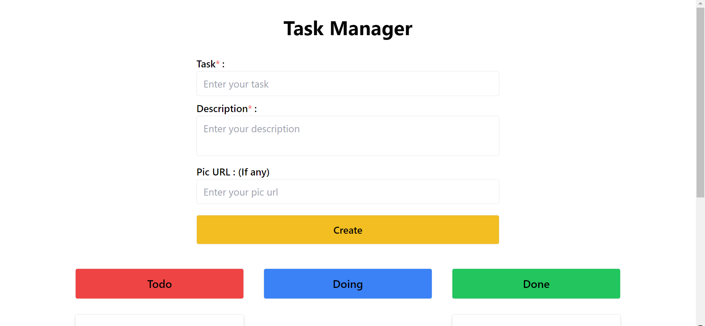
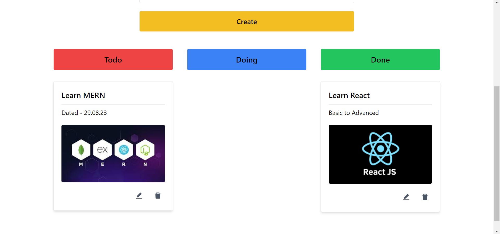
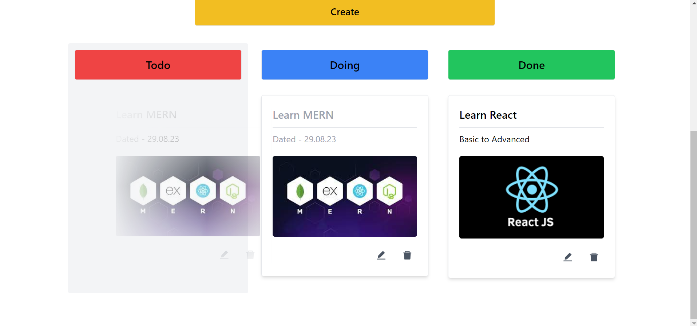

# Task Management App

The Task Management App is a web application built using the MERN (MongoDB, Express, React, Node.js) tech stack that allows users to efficiently manage their tasks. The app provides a user-friendly interface to add, update, and delete tasks, with the added functionality of using drag and drop to move tasks between different status categories such as "To-Do," "Doing," and "Done." The app is fully responsive, ensuring a seamless experience across various devices.

## Features

- **Add Task**: Users can easily add new tasks, providing a title, description, and selecting a status category.

- **Update Task**: Tasks can be updated by dragging and dropping them from one status category to another. This simplifies the process of moving tasks that are in progress or completed.

- **Delete Task**: Tasks that are no longer needed can be deleted from the list.

- **Drag and Drop**: The app allows users to drag tasks from the "To-Do" section to the "Doing" section, and finally to the "Done" section, reflecting their current status.

- **Responsive Design**: The app is responsive and works smoothly on various devices, including desktops, tablets, and smartphones.

## Tech Stack

The app is built using the following technologies:

- **Frontend**: The frontend is developed using **React**, a popular JavaScript library for building user interfaces. It utilizes modern UI components to ensure a smooth and intuitive experience.

- **Backend**: The backend is powered by **Node.js** and **Express**, providing a robust and efficient server for handling API requests and interactions with the database.

- **Database**: The app utilizes **MongoDB**, a NoSQL database, to store and manage task data.

- **Drag and Drop**: The drag and drop functionality is implemented using libraries like **react-beautiful-dnd**, making task management seamless and user-friendly.

## Backend API

The backend of the app provides a set of API endpoints to perform CRUD (Create, Read, Update, Delete) operations on tasks. The API is live and can be accessed by frontend requests to manage tasks effectively.

## Screenshots

Create Task:

Task Status:

Drag n Drop:

## Contributing

Contributions are welcome! If you find any issues or would like to enhance the app, feel free to submit a pull request.

---

Feel free to customize this `README.md` file to provide more specific information about your project. Good luck with your Task Management App, and happy coding!
